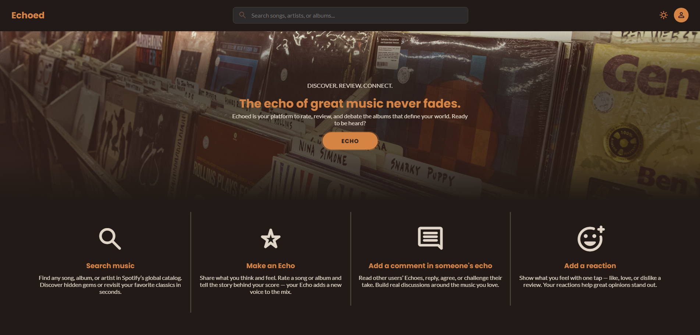
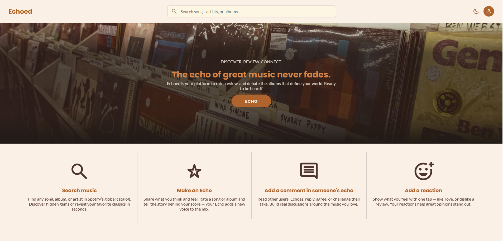
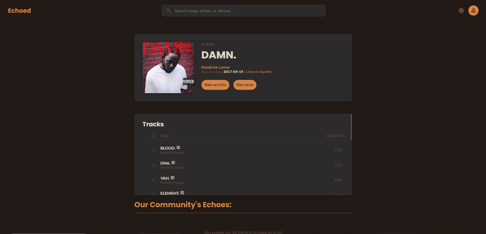
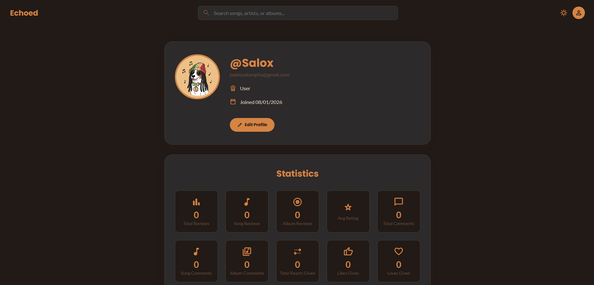
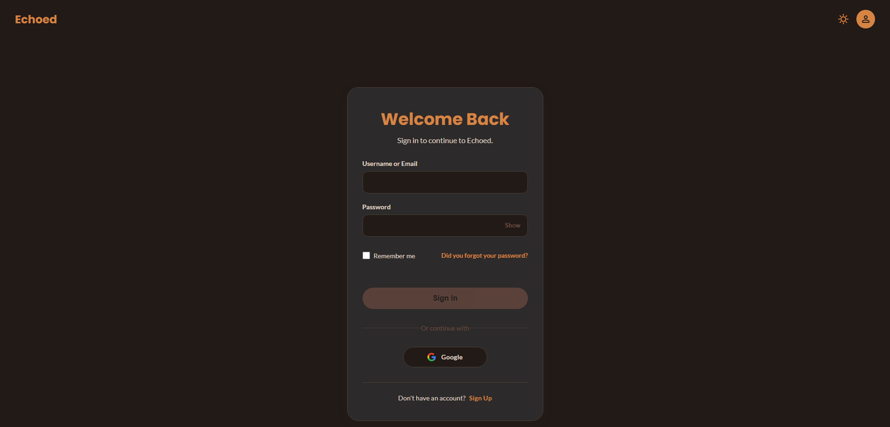

# 🎵 Echoed - Music Streaming Client


**The modern interface for music discovery**. Echoed is a Single Page Application (SPA) built with **Angular (Standalone Architecture)** that offers a rich, interactive, and responsive user experience. It connects seamlessly with our Spring Boot API to bring music, reviews, and social interactions to life.

🔗 **Quick Links**
- **Live Demo**: [https://echoed-front.vercel.app](https://echoed-front.vercel.app)
- **Backend Repository**: [https://github.com/frannquir/utnmusicapp]

---

### 📸 Interface Preview

The application features a fully responsive design with **Dark/Light Mode** support.

**Home Discovery (Dark)**




**Discovery (Light Mode)**

 |


**Album Details**




**User Profile**




**Admin Dashboard**


**Secure Login**



---

## ✨ Key Features

### 🎧 Immersive Discovery
* **Dynamic Carousels:** Interactive sliding components (`GenericCarousel`, `SongCarousel`) for Trending Songs, New Releases, and Top Artists.
* **Smart Search:** Global search bar (`SearchBarComponent`) integrated with Spotify metadata for instant results.
* **Rich Details:** Dedicated views for every entity:
    * `ArtistDetails`: Biography, top tracks, and album discography.
    * `AlbumDetails`: Tracklist, release date, and community ratings.

### 👤 Social & Community
* **Review System:** Users can write reviews (`ReviewModal`), rate content (1-5 Stars), and edit their feedback.
* **Social Interactions:**
    * **Comments:** Threaded conversations on reviews (`CommentList`, `CommentCard`).
    * **Reactions:** Like/Dislike system (`ReactionBar`) powered by optimistic UI updates.
* **User Identity:** Profile management with custom Bio and a fun **Avatar Picker** (`AvatarPickerModal`) featuring exclusive characters (Classic Dog, Techno Dog, Metal Wolf, etc.).

### 🛡️ Security & Administration
* **Robust Auth:** JWT-based authentication with **Google OAuth2** integration.
    * Components: `Login`, `Register`, `Oauth2Callback`.
    * Recovery: `ForgotPasswordModal`, `ChangePasswordModal`.
* **Guards & Interceptors:**
    * `AuthGuard`: Protects private routes.
    * `AdminGuard`: Secures back-office panels.
    * `AuthInterceptor`: Automatically attaches Tokens to requests and handles 401 errors.
* **Admin Dashboard:** Exclusive panel to visualize user stats, manage reports, and moderate users.
    * **Moderation Tools:** `BannedAccountModal`, `DeactivateAccountModal`, `ReactivateAccountModal`.
  
---

## 🛠️ Tech Stack

This project leverages the latest **Angular (v17+)** features:

* **Architecture:** **Standalone Components** (No NgModules), lazy loading routes.
* **State Management:** Angular **Signals** & RxJS for reactive data flow.
* **Styling:** CSS Variables for theming (Dark/Light) + Bootstrap 5 for layout grid.
* **Internationalization:** `@ngx-translate` for real-time English/Spanish switching.
* **Forms:** Reactive Forms for validation (Login/Register/Reviews).

---

## 📂 Project Structure

Organized by feature and domain logic (Angular Standalone Architecture):

```
src/app/
├── components/          # Reusable UI Blocks (Dumb Components)
│   ├── album-carousel/  # Horizontal scroll for albums
│   ├── artist-albums-carousel/
│   ├── avatar-picker-modal/ # Gamified avatar selection
│   ├── comment-list/    # Threaded comments & recursion
│   ├── reaction-bar/    # Like/Dislike logic component
│   ├── review-modal/    # Form for creating/editing reviews
│   ├── star-rating/     # Interactive rating stars
│   ├── toast-container/ # Global notification system
│   └── ... (Modals: banned-account, delete-confirmation, etc.)
├── pages/               # Full Views (Smart Components)
│   ├── home/            # Landing page with carousels
│   ├── song-details/    # /song/:id
│   ├── admin-dashboard/ # /admin (Protected)
│   ├── oauth2-callback/ # Google Login handler
│   └── ...
├── services/            # API Communication (Singleton)
│   ├── auth.service.ts  # Login/Register/OAuth
│   ├── theme.service.ts # Dark/Light toggle logic
│   ├── admin.service.ts # Back-office operations
│   └── ...
├── models/              # TypeScript Interfaces (DTOs)
├── guards/              # Route protection logic
├── interceptors/        # HttpInterceptorFn (Token injection)
└── assets/
    ├── i18n/            # en.json, es.json
    └── screenshots/     # Images for README
```

---

## 🚀 Installation & Setup

### Prerequisites
* Node.js v18+
* NPM or Yarn
* Angular CLI (npm install -g @angular/cli)

### Steps

1.  **Clone & Install:**
    ```
    git clone [https://github.com/Salompablo/echoed-prog4-final.git](https://github.com/Salompablo/echoed-prog4-final.git)
    cd echoed-frontend
    npm install
    ```

2.  **Environment Configuration:**
    Create `src/environments/environment.ts` connecting to your local or deployed backend:
  ```
  export const environment = {
    production: false,
    apiUrl: 'http://localhost:8080/api/v1' // Or your Render URL
  };
  ```
    
3.  **Run Development Server:**
    ```
    ng serve
    ```
    Navigate to `http://localhost:4200/`.

---

## 🤝 Contribution
Fork the project.

1. Create your feature branch (git checkout -b feature/AmazingFeature).

2. Commit your changes (git commit -m 'Add some AmazingFeature').

3. Push to the branch (git push origin feature/AmazingFeature).

4. Open a Pull Request.

---

## 📄 License
This project is licensed under the MIT License.

---

## 👥 Authors

* **Manuel Palacios Inza** - *Full Stack Development & Documentation* - [@manuelpalaciosinza](https://github.com/manuelpalaciosinza)
* **Francisco Quiroga** - *Full Stack Development & Documentation* - [@frannquir](https://github.com/frannquir)
* **Julieta Ramos** - *Full Stack Development & Documentation* - [@juliietaramos](https://github.com/juliietaramos)
* **Pablo Salom Pita** - *Full Stack Development & Documentation* - [@salompablo](https://github.com/salompablo)

---

Developed with ❤️ by the **Echoed Team** for the **University Technical Degree in Programming (UTN)**.
